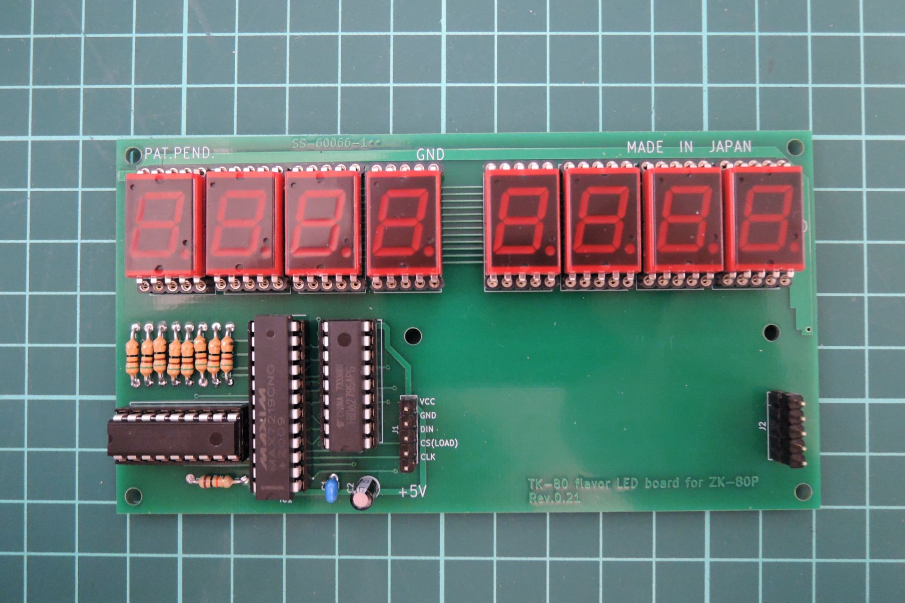
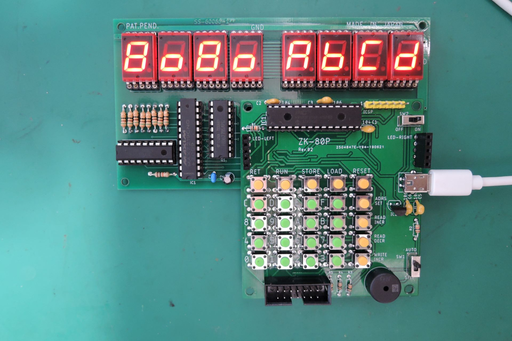
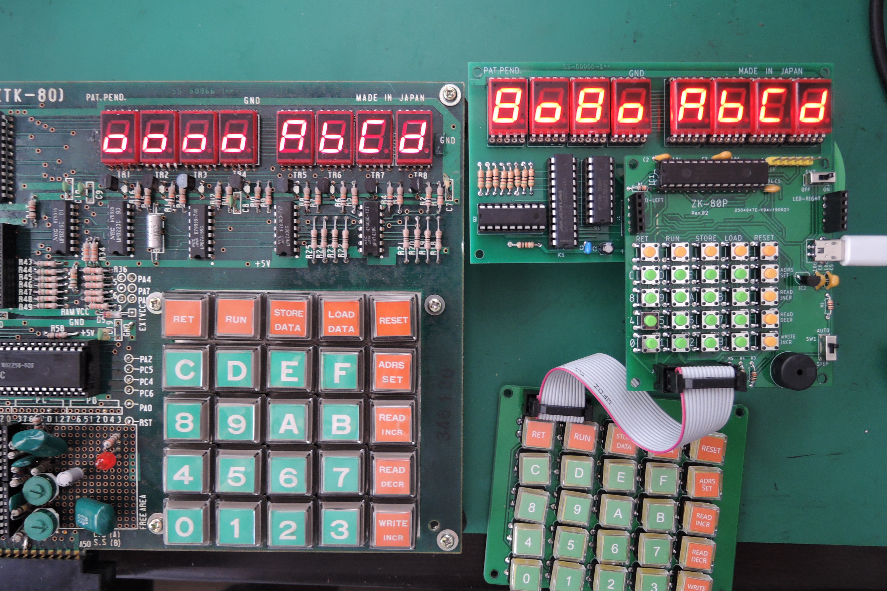
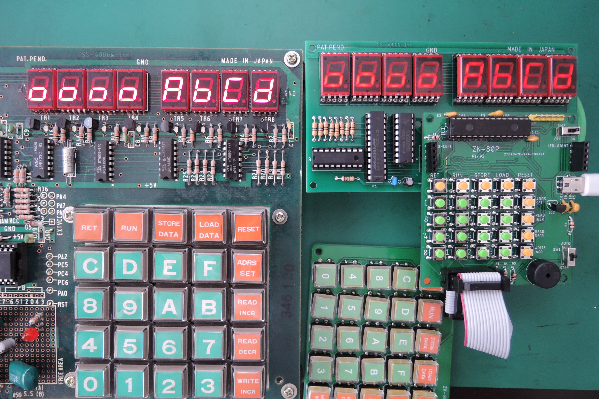

# TK80LED
TK-80互換機(ZK-80P)用LED表示盤(TK-80 flavor LED board for ZK-80P)

## 概要
オレンジピコショップで売られているTK-80互換機(ZK-80 ポケット(ZK-80P))用の表示盤
「TK-80 flavor LED board for ZK-80P」です．

オリジナルのキットの表示がTK-80っぽくなかったので，SN713を使って本物っぽくしてみました．
ZK-80ポケット(ZK-80P)用です．ZK-80には対応していません．

私が勝手に作ったもので，ZK-80, ZK-80Pの作者様やピコソフト様とは無関係です．

SN713Bはタカヒロ電子の通販で購入可能です．(2023年5月29日現在, 税込143円, 在庫数312)

## 基板
配線パターン，LED配置，シルクはかなり実機に似せて作ってあります．

## ファームウェア書き換えについて
ZK-80PはMAX7219の輝度の設定値が小さいので，そのままの設定でSN713を駆動するとかなり暗いです．
明るくするためには，ZK-80Pのファームウェアを書き換えが必要です．
ファームウェアの書き換えについては下記のブログをご参照下さい．

ファームウェア書き換え後

実機との比較

ファームウェア書き換え前

## 関連ブログ
 - [ZK-80(TK-80互換機)のLED改装](https://blog.goo.ne.jp/tk-80/e/5548a42761d789a6131d8d7753d236a3)

## 免責事項
- 本機によってZK-80Pに不具合等が発生しても一切関知しません．
